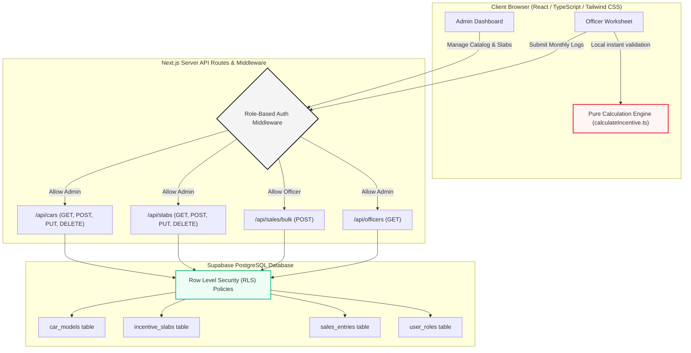

# Toyota Incentive Calculator
> Built for Nippon Toyota · Technical Internship Assignment R2

## Live Demo
[Live URL Placeholder](https://toyota-incentive-portal.vercel.app) · [GitHub Repository Placeholder](https://github.com/nippon-toyota/incentive-calculator)

---

## Overview
The Toyota Incentive Calculator is a production-grade, double-scaffold enterprise portal built specifically to streamline dealership operations, record logged monthly vehicle volumes, and calculate sales officer payouts. Commissioned by Nippon Toyota, this tool automates calculations based on tiered incentive slabs, replacing legacy offline calculation spreadsheets with a highly secure, responsive, role-restricted web interface.

The application is engineered on top of Next.js 14, using a role-driven architectural split to isolate administrator catalog operations from officer log entry fields. The core incentive engine is implemented as a mathematically pure functional calculation unit, securing deterministic speed and absolute testability. Supported by a real-time Postgres database hosted on Supabase, the portal supports instantaneous visual sync, offline mock fallbacks, and bulletproof security guards.

---

## System Architecture

Below is the high-level system architecture and logical data-flow diagram of the Toyota Incentive Portal, showing role-based client interaction, secure Server API validation routes, and relational database layers protected by Row Level Security (RLS):



---

## Features


### Admin Portal
- **Dashboard Overview**: Monitor dealership operations at a glance. Features cards tracking active models, total sales officer rosters, total monthly sales volume, and the top-performing officer.
- **Car Catalog Performance Grid**: Tracks current month sales breakdown per car model, showing actual units sold and visual market share bars.
- **Dynamic Action Timeline Feed**: Streamlines operations by tracking the last 10 transaction logs inputted by sales officers.
- **Car Models Catalog Manager**: Complete CRUD workspace permitting administrators to add new vehicle names, variant trims, and hosted asset photography, as well as toggle activation parameters.
- **Incentive Slabs Editor**: Contiguous tier matrix table permitting administrators to add, update, or delete incentive rates inline. Features client-side range overlap checks and automatic annual impact projections.
- **Visual Slab Ladder**: Stepped visual block diagram mapping incentive thresholds and highlighting the most lucrative tier automatically.

### Sales Officer Portal
- **Interactive Calculator Worksheet**: Permits sales officers to log monthly volumes for each active vehicle using circular stepper buttons, calculating payouts instantly.
- **Live Payout Summary Sidebar**: Puts the live estimated incentive payout in large ₹40px texts, scaling slightly on updates.
- **Milestone Progress Nudges**: Encourages dealer volume by showing amber notifications detailing how many more units are needed to unlock the next higher rate tier, supported by thin progress lines.
- **Unlocked Period Gating**: Limits editing permissions strictly to the active calendar month. Supports left/right navigation arrows to scroll and review historical logs in read-only lock states.
- **Bulk Save Operations**: Packages all stepper changes into a single bulk transaction.

---

## Tech Stack

| Technology | Purpose | Why Chosen |
| :--- | :--- | :--- |
| **Next.js 14** | Full-Stack Web App Framework | App Router supports secure Server Components, optimized streaming rendering, and robust folder-based API route routing. |
| **TypeScript** | Static Typing Safeguards | Strictly prevents compiler bugs and provides clean contract interfaces for calculation results and database entities. |
| **Supabase SSR** | Auth, DB & Row Level Security | PostgreSQL backend provides real-time client SDKs, integrated cookie sessions, and granular Row Level Security (RLS) guards per table. |
| **Tailwind CSS** | Styling System | Speeds up styling workflows, supports responsive breakpoint utilities, and compiles optimized, flat production bundles. |
| **Radix UI** | Accessible Primitive Modals | Provides highly standard screen-reader and focus-trap accessible components for dialogs and warning confirmation boxes. |
| **Lucide React** | Portal Vectors & Icons | Crisp, lightweight, pixel-perfect icons consistent with the premium dashboard portal design. |
| **Vitest** | Engine Test Automation | Fast, lightweight test compiler verifying the pure calculation engine over heavy boundary matrices. |
| **Zod** | Input Schema Validation | Validates form fields and API bodies, throwing structured errors before transactions reach database columns. |

---

## Architecture Decisions

### Next.js 14 App Router Splitting
Using Next.js App Router folders allows the portal to cleanly segment pages by role (`src/app/admin/` and `src/app/officer/`). This folder division maps directly to security middleware, which intercepts incoming request paths and guards them against unauthorized sessions. Furthermore, Next.js Server Components load database metadata directly on the server, boosting speed and eliminating client-side loading cascades.

### Supabase Relational Database & RLS
We selected Supabase for its scalable PostgreSQL engine and robust security layers. By setting up Row Level Security (RLS) policies directly on the tables (`car_models`, `incentive_slabs`, `user_roles`, `sales_entries`), database access is protected at the query level. Even if client credentials leak, officers can only select, insert, or update their own sales logs, while administrators retain master permissions.

### Pure Calculation Engine
The incentive calculation engine in `src/lib/calculateIncentive.ts` is implemented using strictly pure functions with zero side effects and zero external imports. This deliberate decoupling guarantees that calculations are deterministic and can be thoroughly tested using Vitest. By running calculations synchronously on the client, the officer calculator dashboard feels instantaneous, while the exact same code runs on backend API routes during data writing to ensure complete consistency.

### Modular Folder Directory Tree
Separating reusable presentational components (`src/components/shared/`), role layout elements (`src/components/admin/`, `src/components/officer/`), and pure business calculators (`src/lib/`) keeps the codebase highly legible. New full-stack developers can locate routing targets instantly, modify visual aspects without risking calculation errors, and trace database migrations.

---

## Local Development Setup

### 1. Prerequisites
Ensure you have the following installed on your machine:
- **Node.js**: Version 18.0.0 or higher
- **npm**: Version 9.0.0 or higher
- **Supabase CLI** (optional, for local schema management)

### 2. Clone the Repository
```bash
git clone https://github.com/nippon-toyota/incentive-calculator.git
cd toyota
```

### 3. Install Dependencies
```bash
npm install
```

### 4. Supabase Project Setup
1. Go to the [Supabase Dashboard](https://supabase.com) and click **"New Project"**.
2. Name your project (e.g. `Toyota Incentive Portal`) and set a secure database password.
3. Once the database is provisioned, navigate to **Project Settings** → **API**.
4. Retrieve your **Project URL** and **Anon Public Key**.

### 5. Environment Variables
Create a `.env.local` file in the root directory:
```env
# Supabase Project API Keys (Retrieved from Settings -> API)
NEXT_PUBLIC_SUPABASE_URL=https://your-project-id.supabase.co
NEXT_PUBLIC_SUPABASE_ANON_KEY=eyJhbGciOiJIUzI1NiIsInR5cCI6IkpXVCJ9...
```

### 6. Database Setup
1. Inside the Supabase Dashboard, open the **SQL Editor** tab from the left sidebar.
2. Click **"New Query"**, copy the entire contents of [schema.sql](file:///Users/sangeethps/toyota/supabase/schema.sql), paste it in, and click **"Run"** to establish tables, indexes, functions, triggers, and RLS policies.
3. Open a second **"New Query"**, copy [seed.sql](file:///Users/sangeethps/toyota/supabase/seed.sql), paste it in, and click **"Run"** to populate car models and default slabs.

### 7. Create Test Users
Navigate to **Authentication** → **Users** inside your Supabase dashboard and create two new users matching the demo credentials below. Once created:
1. Grab their unique user UUIDs from the dashboard list.
2. Open the **SQL Editor** and insert matching user mapping role rows inside the `user_roles` table:
```sql
INSERT INTO public.user_roles (user_id, role, full_name)
VALUES 
  ('admin-user-uuid-here', 'admin', 'Toyota Administrator'),
  ('officer-user-uuid-here', 'officer', 'Sangeeth PS');
```

### 8. Start Local Development
```bash
npm run dev
```
Open your browser and navigate to `http://localhost:3000` to interact with the portal.

---

## Test Accounts

| Role | Email | Password | Role Description |
| :--- | :--- | :--- | :--- |
| **Admin** | `admin@toyota-demo.com` | `Toyota@123` | Master administrator managing catalog files, slabs, and viewing activity. |
| **Officer** | `officer@toyota-demo.com` | `Toyota@123` | Sales Officer logging car sales volumes and viewing active payouts. |

---

## Deployment (Vercel)

Deploying a Next.js 14 App Router project to Vercel is streamlined:
1. Go to the [Vercel Dashboard](https://vercel.com) and click **"Add New"** → **"Project"**.
2. Import your GitHub repository.
3. Under **Build & Development Settings**, Vercel automatically selects **Next.js** as the framework template.
4. Expand the **Environment Variables** panel and add:
   - `NEXT_PUBLIC_SUPABASE_URL`
   - `NEXT_PUBLIC_SUPABASE_ANON_KEY`
5. Click **"Deploy"**. Vercel will build, optimize static routes, compile Tailwind assets, and distribute pages globally.

---

## Folder Structure

```text
toyota/
├── supabase/                       # Supabase migration scripts
│   ├── schema.sql                  # DDL tables, triggers, policies & indexes
│   └── seed.sql                    # Initial cars, slabs, and user guidelines
├── vercel.json                     # Vercel platform configurations
├── package.json                    # Project dependency manifest
├── tsconfig.json                   # TypeScript strict-mode config
├── tailwind.config.ts              # Tailwind CSS brand colors and styles configuration
├── vitest.config.ts                # Test runner configuration
├── src/
│   ├── middleware.ts               # Auth gates and role redirects middleware
│   ├── app/                        # Next.js App Router directories
│   │   ├── globals.css             # Tailwind directives and HSL root variables
│   │   ├── layout.tsx              # Root HTML wrapper with ToastProvider
│   │   ├── loading.tsx             # Pulsing fullscreen boot screen loading portal
│   │   ├── error.tsx               # Master Crash boundary fallback console
│   │   ├── not-found.tsx           # Branded minimal 404 page
│   │   ├── login/
│   │   │   └── page.tsx            # Premium full-page loginbackdrop portal
│   │   ├── admin/                  # Protected Administrative pages
│   │   │   ├── layout.tsx          # Admin layout gating sessions and rendering sidebars
│   │   │   ├── dashboard/
│   │   │   │   └── page.tsx        # Overview statistics row and timeline feed
│   │   │   ├── cars/
│   │   │   │   └── page.tsx        # CRUD catalog list manager
│   │   │   └── slabs/
│   │   │       └── page.tsx        # Inline incentive matrix table editor
│   │   ├── officer/                # Protected Sales Officer pages
│   │   │   ├── layout.tsx          # Officer layout gating sessions and rendering top navs
│   │   │   └── dashboard/
│   │   │       └── page.tsx        # Dynamic worksheet and live calculation panels
│   │   └── api/                    # REST Endpoint Route Handlers
│   │       ├── cars/
│   │       │   ├── route.ts        # GET catalog / POST car models
│   │       │   └── [id]/
│   │       │       └── route.ts    # PUT details / DELETE soft-deactivation
│   │       ├── slabs/
│   │       │   ├── route.ts        # GET slabs / POST new ranges
│   │       │   └── [id]/
│   │       │       └── route.ts    # PUT thresholds / DELETE tier limits
│   │       ├── sales/
│   │       │   ├── route.ts        # GET scoped sales logs / POST log
│   │       │   └── bulk/
│   │       │       └── route.ts    # POST bulk worksheet saves
│   │       └── officers/
│   │           └── route.ts        # GET sales officers list
│   ├── components/                 # Shared and Modular UI Components
│   │   ├── admin/                  # Administrative specific components
│   │   │   ├── AdminSidebar.tsx    # Responsive side drawer
│   │   │   ├── StatsSection.tsx    # Dashboard statistics panel
│   │   │   ├── PerformanceSection.tsx # Performance metrics table
│   │   │   ├── ActivityFeedSection.tsx # Activity logs timeline feed
│   │   │   ├── CarModelCard.tsx    # Card layout with hover lift details
│   │   │   ├── CarModelFormModal.tsx # Radix form overlay
│   │   │   ├── CarModelGrid.tsx    # Grid shell holding cards and forms
│   │   │   ├── SlabTable.tsx       # Inline slabs configuration table
│   │   │   └── SlabRow.tsx         # Inline slab row editor
│   │   ├── officer/                # Sales Officer specific components
│   │   │   ├── OfficerTopNav.tsx   # Top navigation fixed header
│   │   │   ├── SalesDashboard.tsx  # Dynamic dashboard parent layout
│   │   │   ├── CarVolumeCard.tsx   # Stepper car quantity logs
│   │   │   ├── IncentivePanel.tsx  # live summary payout panel
│   │   │   └── SlabLadder.tsx      # Milestone progress visualizer
│   │   └── shared/                 # Reusable utility primitives
│   │       ├── EmptyState.tsx      # placeholder lists cards
│   │       ├── LoadingSkeleton.tsx # Pulsing card and table components
│   │       ├── ConfirmDialog.tsx   # Radix alert warning buttons
│   │       └── Toast.tsx           # Custom slides notifications
│   └── lib/                        # Business logics and configurations
│       ├── types.ts                # Application interfaces and typings
│       ├── constants.ts            # Fixed routes and app parameters
│       ├── utils.ts                # Shared formatting utilities
│       ├── api-helpers.ts          # REST authentication builders
│       ├── calculateIncentive.ts   # Synchronous pure calculation engine
│       ├── calculateIncentive.test.ts # 38 Vitest engine tests
│       └── supabase/               # Supabase instance builders
│           ├── client.ts           # Client component browser connection
│           └── server.ts           # Server component cookie connection
```

---

## API Reference

| Method | Path | Auth Level | Description |
| :--- | :--- | :--- | :--- |
| **GET** | `/api/cars` | Authenticated | Returns all active car models, ordered alphabetically by name. |
| **POST** | `/api/cars` | Administrator Only | Creates a new car model. Validates that `name` is a non-empty string. |
| **PUT** | `/api/cars/[id]` | Administrator Only | Patches fields on a specific model (e.g. name, variant, status). |
| **DELETE** | `/api/cars/[id]` | Administrator Only | Soft-deactivates model (sets `is_active = false`) keeping history intact. |
| **GET** | `/api/slabs` | Authenticated | Returns all incentive slabs, sorted ascending by volume starting thresholds. |
| **POST** | `/api/slabs` | Administrator Only | Creates a new slab. Validates thresholds and prevents range overlaps. |
| **PUT** | `/api/slabs/[id]` | Administrator Only | Updates slab values. Performs re-validation checks for range overlaps. |
| **DELETE** | `/api/slabs/[id]` | Administrator Only | Deletes a slab. Blocks action if it is the last remaining tier in database. |
| **GET** | `/api/sales` | Authenticated | Queries logged entries for a month. Scopes results automatically to officer. |
| **POST** | `/api/sales` | Officer Only | Creates or updates a single model logged sales quantity. |
| **POST** | `/api/sales/bulk` | Officer Only | Bulk upserts monthly worksheet entries in a single, high-speed db call. |
| **GET** | `/api/officers` | Administrator Only | Returns all sales officers and dates registered inside Nippon Toyota. |
