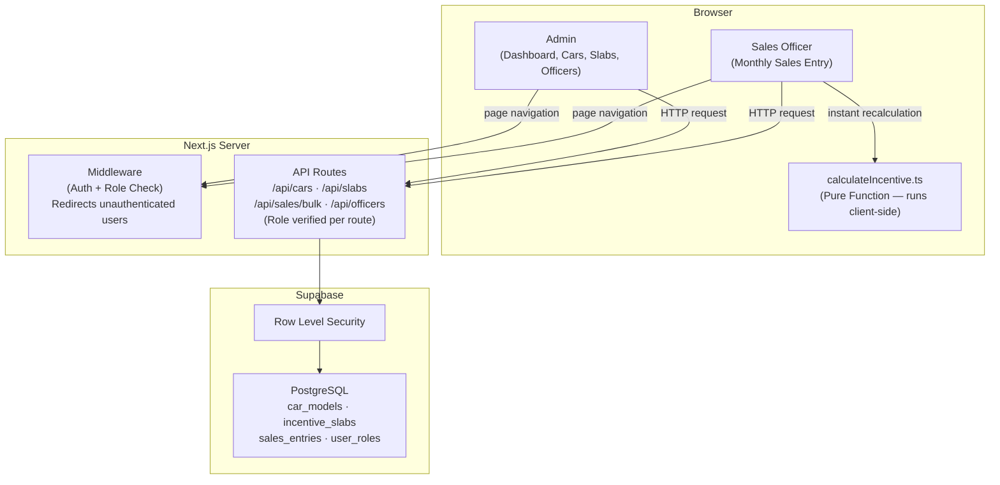

# Toyota Incentive Calculator
> Built for Nippon Toyota · Technical Internship Assignment 

## Live Demo
<!-- TODO: Replace with actual deployed URL and GitHub repo URL -->
Live Deployment URL : https://toyota-phi-dun.vercel.app

---

## Overview
The Toyota Incentive Calculator is a web application built for Nippon Toyota to manage vehicle sales volume logging and calculate sales officer payouts. The tool automates calculations based on tiered incentive slabs, replacing manual spreadsheet-based tracking with a role-based web interface.

The application is built on Next.js 14, using a role-based architecture to separate administrator operations from officer log entry forms. The incentive engine is implemented as a pure function to ensure deterministic calculations, supported by a PostgreSQL database hosted on Supabase with real-time updates.

---

## System Architecture

Below is the high-level system architecture and logical data-flow diagram of the Toyota Incentive Portal, showing role-based client interaction, secure Server API validation routes, and relational database layers protected by Row Level Security (RLS):



---

## Features

### Admin Portal
- **Dashboard Overview**: Monitor active car models, registered sales officers, monthly sales volumes, and the top-performing officer.
- **Car Catalog Performance Grid**: Displays the current month's sales breakdown per model with visual market share bars.
- **Dynamic Action Timeline Feed**: Displays a log of the last 10 transactions recorded by sales officers.
- **Car Models Catalog Manager**: Provides a CRUD workspace to manage vehicle names, variants, images, and activation status.
- **Incentive Slabs Editor**: A slab editor table to add, update, or delete incentive rates with overlap validation.
- **Visual Slab Ladder**: Displays incentive thresholds in a stepped block diagram highlighting the active tier.

### Sales Officer Portal
- **Interactive Calculator Worksheet**: Allows officers to log monthly sales quantities using stepper inputs with live payout calculations.
- **Live Payout Summary Sidebar**: Displays the live estimated incentive payout updated in real-time.
- **Milestone Progress Nudges**: Displays notifications indicating the number of units needed to unlock the next incentive tier.
- **Month Selector**: Officers can navigate between months to log or update sales entries for any period.
- **Bulk Save Operations**: Saves all pending worksheet changes in a single database transaction.

---

## Tech Stack

| Technology | Purpose | Why Chosen |
| :--- | :--- | :--- |
| **Next.js 14** | Full-Stack Web App Framework | App Router supports server components, optimized rendering, and folder-based API routing. |
| **TypeScript** | Static Typing Safeguards | Provides static typing to prevent compile-time bugs and define clean object interfaces. |
| **Supabase SSR** | Auth, DB & Row Level Security | Provides a PostgreSQL database, integrated cookie sessions, and Row Level Security. |
| **Tailwind CSS** | Styling System | Enables rapid styling with responsive utilities and optimized output files. |
| **Radix UI** | Accessible Primitive Modals | Provides accessible primitives for dialogs and confirmation overlays. |
| **Lucide React** | Portal Vectors & Icons | Provides a consistent set of lightweight icons. |
| **Vitest** | Engine Test Automation | A fast unit testing framework to verify calculations. |
| **Zod** | Input Schema Validation | Performs runtime schema validation for form submissions and API bodies. |

---

## Architecture Decisions

### Next.js 14 App Router Splitting
The portal uses the Next.js App Router to segment pages by role under admin and officer directories. This structure integrates with middleware to intercept requests and authorize sessions. Server components fetch database metadata directly on the server to reduce loading times.

### Supabase Relational Database & RLS
We chose Supabase for its PostgreSQL engine and security capabilities. Row Level Security policies secure database tables at the query level. Officers can only view and update their own logs, while administrators maintain full write permissions.

### Pure Calculation Engine
The incentive calculation engine in `src/lib/calculateIncentive.ts` uses pure functions without external imports. This decoupling ensures that calculations are deterministic and easily testable. The exact same calculation runs on the client and the backend to ensure consistency.

### Modular Folder Directory Tree
Dividing the codebase into UI components, layout elements, and business logic files ensures high readability. This makes it easy to locate files, update styles without breaking calculations, and manage database migrations.

---

## Local Development Setup

### 1. Prerequisites
Ensure you have the following installed on your machine:
- **Node.js**: Version 18.0.0 or higher
- **npm**: Version 9.0.0 or higher
- **Supabase CLI** (optional, for local schema management)

### 2. Clone the Repository
```bash
git clone https://github.com/nippon-toyota/incentive-calculator.git
cd toyota
```

### 3. Install Dependencies
```bash
npm install
```

### 4. Supabase Project Setup
1. Go to the [Supabase Dashboard](https://supabase.com) and click **"New Project"**.
2. Name your project (e.g. `Toyota Incentive Portal`) and set a secure database password.
3. Once the database is provisioned, navigate to **Project Settings** → **API**.
4. Retrieve your **Project URL** and **Anon Public Key**.

### 5. Environment Variables
Create a `.env.local` file in the root directory:
```env
# Supabase Project API Keys (Retrieved from Settings -> API)
NEXT_PUBLIC_SUPABASE_URL=https://your-project-id.supabase.co
NEXT_PUBLIC_SUPABASE_ANON_KEY=your-anon-key
```

### 6. Database Setup
1. Inside the Supabase Dashboard, open the **SQL Editor** tab from the left sidebar.
2. Click **"New Query"**, copy the entire contents of schema.sql, paste it in, and click **"Run"** to establish tables, indexes, functions, triggers, and RLS policies.
3. Open a second **"New Query"**, copy seed.sql, paste it in, and click **"Run"** to populate car models and default slabs.

### 7. Create Test Users
Navigate to **Authentication** → **Users** inside your Supabase dashboard and create two new users matching the demo credentials below. Once created:
1. Grab their unique user UUIDs from the dashboard list.
2. Open the **SQL Editor** and insert matching user mapping role rows inside the `user_roles` table:
```sql
INSERT INTO public.user_roles (user_id, role, full_name)
VALUES 
  ('admin-user-uuid-here', 'admin', 'Toyota Administrator'),
  ('officer-user-uuid-here', 'officer', 'Sangeeth PS');
```

### 8. Start Local Development
```bash
npm run dev
```
Open your browser and navigate to `http://localhost:3000` to interact with the portal.

---

## Test Accounts

| Role | Email | Password | Role Description |
| :--- | :--- | :--- | :--- |
| **Admin** | `admin@toyota-demo.com` | `Toyota@123` | Master administrator managing catalog files, slabs, and viewing activity. |
| **Officer** | `officer@toyota-demo.com` | `Toyota@123` | Sales Officer logging car sales volumes and viewing active payouts. |

---

## Running Tests

### Unit Tests
Covers the incentive calculation engine (calculateIncentive.ts).
```bash
npx vitest run
```

### End-to-End Tests
Full browser tests across admin and officer workflows.
Requires the dev server to be running.
```bash
# Terminal 1
npm run dev

# Terminal 2
npx playwright test

# View results
npx playwright show-report
```

E2E tests require a `.env.test` file:
```env
BASE_URL=http://localhost:3000
ADMIN_EMAIL=your-admin-email
ADMIN_PASSWORD=your-admin-password
OFFICER_EMAIL=your-officer-email
OFFICER_PASSWORD=your-officer-password
TEST_OFFICER_ID=uuid-of-officer-in-supabase
SUPABASE_SERVICE_ROLE_KEY=your-service-role-key
```

---

## Deployment (Vercel)

Deploying a Next.js 14 App Router project to Vercel is streamlined:
1. Go to the [Vercel Dashboard](https://vercel.com) and click **"Add New"** → **"Project"**.
2. Import your GitHub repository.
3. Under **Build & Development Settings**, Vercel automatically selects **Next.js** as the framework template.
4. Expand the **Environment Variables** panel and add:
   - `NEXT_PUBLIC_SUPABASE_URL`
   - `NEXT_PUBLIC_SUPABASE_ANON_KEY`
5. Click **"Deploy"**. Vercel will build, optimize static routes, compile Tailwind assets, and distribute pages globally.

---

## Folder Structure

```text
toyota/
├── supabase/                       # Supabase migration scripts
│   ├── schema.sql                  # DDL tables, triggers, policies & indexes
│   └── seed.sql                    # Initial cars, slabs, and user guidelines
├── vercel.json                     # Vercel platform configurations
├── package.json                    # Project dependency manifest
├── tsconfig.json                   # TypeScript strict-mode config
├── tailwind.config.ts              # Tailwind CSS brand colors and styles configuration
├── vitest.config.ts                # Test runner configuration
├── src/
│   ├── middleware.ts               # Auth gates and role redirects middleware
│   ├── app/                        # Next.js App Router directories
│   │   ├── globals.css             # Tailwind directives and HSL root variables
│   │   ├── layout.tsx              # Root HTML wrapper with ToastProvider
│   │   ├── loading.tsx             # Pulsing fullscreen boot screen loading portal
│   │   ├── error.tsx               # Master Crash boundary fallback console
│   │   ├── not-found.tsx           # Branded minimal 404 page
│   │   ├── login/
│   │   │   └── page.tsx            # Premium full-page loginbackdrop portal
│   │   ├── admin/                  # Protected Administrative pages
│   │   │   ├── layout.tsx          # Admin layout gating sessions and rendering sidebars
│   │   │   ├── dashboard/
│   │   │   │   └── page.tsx        # Overview statistics row and timeline feed
│   │   │   ├── cars/
│   │   │   │   └── page.tsx        # CRUD catalog list manager
│   │   │   └── slabs/
│   │   │       └── page.tsx        # Inline incentive matrix table editor
│   │   ├── officer/                # Protected Sales Officer pages
│   │   │   ├── layout.tsx          # Officer layout gating sessions and rendering top navs
│   │   │   └── dashboard/
│   │   │       └── page.tsx        # Dynamic worksheet and live calculation panels
│   │   └── api/                    # REST Endpoint Route Handlers
│   │       ├── cars/
│   │       │   ├── route.ts        # GET catalog / POST car models
│   │       │   └── [id]/
│   │       │       └── route.ts    # PUT details / DELETE soft-deactivation
│   │       ├── slabs/
│   │       │   ├── route.ts        # GET slabs / POST new ranges
│   │       │   └── [id]/
│   │       │       └── route.ts    # PUT thresholds / DELETE tier limits
│   │       ├── sales/
│   │       │   ├── route.ts        # GET scoped sales logs / POST log
│   │       │   └── bulk/
│   │       │       └── route.ts    # POST bulk worksheet saves
│   │       └── officers/
│   │           └── route.ts        # GET sales officers list
│   ├── components/                 # Shared and Modular UI Components
│   │   ├── admin/                  # Administrative specific components
│   │   │   ├── AdminSidebar.tsx    # Responsive side drawer
│   │   │   ├── StatsSection.tsx    # Dashboard statistics panel
'│   │   │   ├── PerformanceSection.tsx # Performance metrics table
│   │   │   ├── ActivityFeedSection.tsx # Activity logs timeline feed
│   │   │   ├── CarModelCard.tsx    # Card layout with hover lift details
│   │   │   ├── CarModelFormModal.tsx # Radix form overlay
│   │   │   ├── CarModelGrid.tsx    # Grid shell holding cards and forms
│   │   │   ├── SlabTable.tsx       # Inline slabs configuration table
│   │   │   └── SlabRow.tsx         # Inline slab row editor
│   │   ├── officer/                # Sales Officer specific components
│   │   │   ├── OfficerTopNav.tsx   # Top navigation fixed header
│   │   │   ├── SalesDashboard.tsx  # Dynamic dashboard parent layout
│   │   │   ├── CarVolumeCard.tsx   # Stepper car quantity logs
│   │   │   ├── IncentivePanel.tsx  # live summary payout panel
│   │   │   └── SlabLadder.tsx      # Milestone progress visualizer
│   │   └── shared/                 # Reusable utility primitives
│   │   │   ├── EmptyState.tsx      # placeholder lists cards
│   │   │   ├── LoadingSkeleton.tsx # Pulsing card and table components
│   │   │   ├── ConfirmDialog.tsx   # Radix alert warning buttons
│   │   │   └── Toast.tsx           # Custom slides notifications
│   └── lib/                        # Business logics and configurations
│       ├── types.ts                # Application interfaces and typings
│       ├── constants.ts            # Fixed routes and app parameters
│       ├── utils.ts                # Shared formatting utilities
│       ├── api-helpers.ts          # REST authentication builders
│       ├── calculateIncentive.ts   # Synchronous pure calculation engine
│       ├── calculateIncentive.test.ts # 18 unit tests
│       └── supabase/               # Supabase instance builders
│           ├── client.ts           # Client component browser connection
│           └── server.ts           # Server component cookie connection
```

---

## API Reference

| Method | Path | Auth Level | Description |
| :--- | :--- | :--- | :--- |
| **GET** | `/api/cars` | Authenticated | Returns all active car models, ordered alphabetically by name. |
| **POST** | `/api/cars` | Administrator Only | Creates a new car model. Validates that `name` is a non-empty string. |
| **PUT** | `/api/cars/[id]` | Administrator Only | Patches fields on a specific model (e.g. name, variant, status). |
| **DELETE** | `/api/cars/[id]` | Administrator Only | Soft-deactivates model (sets `is_active = false`) keeping history intact. |
| **GET** | `/api/slabs` | Authenticated | Returns all incentive slabs, sorted ascending by volume starting thresholds. |
| **POST** | `/api/slabs` | Administrator Only | Creates a new slab. Validates thresholds and prevents range overlaps. |
| **PUT** | `/api/slabs/[id]` | Administrator Only | Updates slab values. Performs re-validation checks for range overlaps. |
| **DELETE** | `/api/slabs/[id]` | Administrator Only | Deletes a slab. Blocks action if it is the last remaining tier in database. |
| **GET** | `/api/sales` | Authenticated | Queries logged entries for a month. Scopes results automatically to officer. |
| **POST** | `/api/sales` | Officer Only | Creates or updates a single model logged sales quantity. |
| **POST** | `/api/sales/bulk` | Officer Only | Bulk upserts monthly worksheet entries in a single, high-speed db call. |
| **GET** | `/api/officers` | Administrator Only | Returns all sales officers and dates registered inside Nippon Toyota. |
